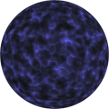
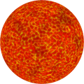

# TSL Textures


## Brain

This texture recreates an organic pattern that resembles
brain or soft tissue with animated sparking threads. 
Click on a snapshot to open it online.

<p class="gallery">

	<a class="style-block nocaption" href="../online/brain.html?scale=0.8&smooth=1&wave=0.5&speed=2.5&color=16765136&background=5242880&seed=0">
		
	</a>

	<a class="style-block nocaption" href="../online/brain.html?scale=1&smooth=0.63&wave=0.56&speed=9.3&color=6053215&background=11315967&seed=0">
		
	</a>

	<a class="style-block nocaption" href="../online/brain.html?scale=4&smooth=1&wave=0.15&speed=10&color=16711680&background=16645888&seed=0">
		
	</a>

</p>


### Code example

```js
import { brain } from "tsl-textures";

model.material.colorNode = brain ( {
	scale: 2,
	smooth: 0.5,
	wave: 0.5,
	speed: 2.5,
	color: new THREE.Color(16765136),
	background: new THREE.Color(5242880),
	seed: 0
} );

model.material.normalNode = brain ( {
	scale: 2,
	smooth: 0.5,
	wave: 0.5,
	speed: 2.5,
	color: new THREE.Color(16765136),
	background: new THREE.Color(5242880),
	seed: 0
} );

```


### Parameters

* `position` &ndash; coordinates used to map texture, default is TSL `positionGeometry` node
* `scale` &ndash; level of details of the pattern, higher value generates finer details, [0, 4]
* `smooth` &ndash; smoothness of wrinkles, [0,1]
* `wave` &ndash; span of spark waves [0,1]
* `speed` &ndash; speed of spark waves pulsation [0,10]
* `time` &ndash; current time for brain wave animation, defaut is TSL's `time` node
* `color` &ndash; main color of the texture
* `background` &ndash; background color of tissue wrinkles
* `seed` &ndash; number for the random generator, each value generates specific pattern


### Online generator

[online/brain.html](../online/brain.html)


### Source

[src/brain.js](https://github.com/boytchev/tsl-textures/blob/main/src/brain.js)


		
<div class="footnote">
	<a href="../">Home</a>
</div>