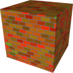
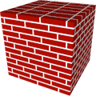
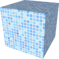

# TSL Textures


## Bricks

This texture recreates various bricks wall &ndash; mossy bricks, Manchester red
bricks or Japanese facade tiles. The texture is volumetric texture, so if a
surface cuts the space through the mortar, it will appear only mortar. The texture
is predominantly focused on objects with flat walls, oriented along axes. Thus
for round or bent surfaces, the mortar layes may form undesired patterns. Click
on a snapshot to open it online.

<p class="gallery">

	<a class="style-block nocaption" href="../online/bricks.html?scale=2&brickSize=2,1,2&brickShift=2&jointSize=0.05&jointSpan=0.5&jointJitter=0.5&jointBlur=0.03&noiseSize=0.5&noiseStrength=0.2&colorShade=0.5&color=16728064&additional=13672496&background=11184810&seed=0">
		
	</a>

	<a class="style-block nocaption" href="../online/bricks.html?scale=1.76&brickSize=3.762,1,2&brickShift=2.919&jointSize=0.0804&jointSpan=0&jointJitter=0&jointBlur=0.03&noiseSize=0.5&noiseStrength=0&colorShade=0&color=13579520&additional=13579520&background=16777215&seed=0">
		
	</a>

	<a class="style-block nocaption" href="../online/bricks.html?scale=2.04&brickSize=1,1,1&brickShift=1&jointSize=0&jointSpan=0&jointJitter=0&jointBlur=0.2&noiseSize=0.43&noiseStrength=0&colorShade=0&color=15006719&additional=12180735&background=16777215&seed=0">
		
	</a>

</p>


### Code example

```js
import { bricks } from "tsl-textures";

model.material.colorNode = bricks ( {
	scale: 2,
	brickSize: new THREE.Vector3(2,1,2),
	brickShift: 2,
	jointSize: 0.05,
	jointSpan: 0.5,
	jointJitter: 0.5,
	jointBlur: 0.03,
	noiseSize: 0.5,
	noiseStrength: 0.2,
	colorShade: 0.5,
	color: new THREE.Color(16728064),
	additional: new THREE.Color(13672496),
	background: new THREE.Color(11184810),
	seed: 0
} );
```


### Parameters

* `scale` &ndash; level of details of the pattern, higher value generates finer details, [0,4]

* `brickSize` &ndash; size of bricks, a 3D vector
* `brickShift` &ndash; horizontal shift between layers, 1 brickes are aligned, 2 bricks are 50% shifted, fractional shifts are allowed [1,4]
* `jointSize` &ndash; size (thickness) of mortar 
* `jointSpan` &ndash; smoothness of mortar boundary, [0,0.2]
* `jointJitter` &ndash; jitterness of mortar boundary, [0,1]
* `jointBlur` &ndash; blur of mortar, [0,1]
* `noiseSize` &ndash; size of additional random noise on bricks are mortar, [0,1]
* `noiseStrength` &ndash; strength of noise, [0,1]
* `color` &ndash; one color of the bricks
* `additional` &ndash; additional color of the bricks
* `colorShade` &ndash; additional darkening of randomly selected bricks, [0, 1]
* `background` &ndash; color of mortar
* `seed` &ndash; number for the random generator, each value generates specific pattern


### Online generator

[online/bricks.html](../online/bricks.html)


### Source

[src/bricks.js](https://github.com/boytchev/tsl-textures/blob/main/src/bricks.js)


		
<div class="footnote">
	<a href="../">Home</a>
</div>