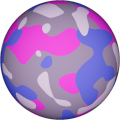
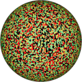

# TSL Textures


## Camouflage

This texture immitates the design of camouflage patters in
military clothes and vehicles. It overlaps four-color spots.
Click on a snapshot to open it online.

<p class="gallery">

	<a class="style-block nocaption" href="../online/camouflage.html?scale=2&colorA=12762792&colorB=10258782&colorC=9610101&colorD=7435617">
		
	</a>

	<a class="style-block nocaption" href="../online/camouflage.html?scale=0.72&colorA=15519740&colorB=6910716&colorC=16662773&colorD=10456237&seed=0">
		
	</a>

	<a class="style-block nocaption" href="../online/camouflage.html?scale=3.24&colorA=16772864&colorB=16711680&colorC=65393&colorD=0&seed=0">
		
	</a>

</p>


### Code template

```js
import { camouflage } from "tsl-textures/camouflage.js";

model.material.colorNode = camouflage ( {
	scale: 2,
	colorA: new THREE.Color(12762792),
	colorB: new THREE.Color(10258782),
	colorC: new THREE.Color(9610101),
	colorD: new THREE.Color(7435617),
	seed: 0
} );
```


### Parameters

* `scale` &ndash; level of details of the pattern, higher value generates finer details, [0, 4]
* `colorA` &ndash; top color
* `colorB` &ndash; second color
* `colorC` &ndash; third color
* `colorD` &ndash; bottom color
* `seed` &ndash; number for the random generator, each value generates specific pattern


### Online generator

[online/camouflage.html](../online/camouflage.html)

### Source

[src/patterns/camouflage.js](https://github.com/boytchev/tsl-textures/blob/main/src/camouflage.js)


		
<div class="footnote">
	<a href="#" onclick="window.history.back(); return false;">Back</a>
</div>