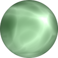

# TSL Textures


## Caustics

This texture recreates an animated caustics-like texture. The light patterns are
not physically correct, they only imitates shimmering and rippling patterns.
Click on a snapshot to open it online.

<p class="gallery">

	<a class="style-block nocaption" href="../online/caustics.html?scale=2&speed=0&color=5286080&seed=0">
		
	</a>

	<a class="style-block nocaption" href="../online/caustics.html?scale=0.68&speed=0&color=12109496&seed=3388">
		
	</a>

	<a class="style-block nocaption" href="../online/caustics.html?scale=2.8&speed=0&color=13275989&seed=3388">
		
	</a>

</p>


### Code example

```js
import { caustics } from "tsl-textures";

model.material.colorNode = caustics ( {
	scale: 2,
	speed: 0,
	color: new THREE.Color(5286080),
	seed: 0
} );
```


### Parameters

* `scale` &ndash; level of details of the pattern, higher value generates finer details, [0, 4]
* `speed` &ndash; caustics motion speed, negative values are slow, positive values are fast, [-2,2]
* `color` &ndash; color of the water
* `seed` &ndash; number for the random generator, each value generates specific pattern


### Online generator

[online/caustics.html](../online/caustics.html)


### Source

[src/caustics.js](https://github.com/boytchev/tsl-textures/blob/main/src/caustics.js)


		
<div class="footnote">
	<a href="../">Home</a>
</div>