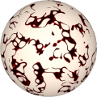
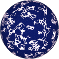
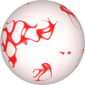

# TSL Textures


## Cave art

This texture recreates a pattern that resembles
[Paleolithic cave art](https://en.wikipedia.org/wiki/Cave_painting).
With some level of imagination and [pareidolia](https://en.wikipedia.org/wiki/Pareidolia)
it is possible to see animals, peoples and even extraterrestrials. 
Click on a snapshot to open it online.

<p class="gallery">

	<a class="style-block nocaption" href="../online/cave-art.html?scale=1.36&thinness=2&noise=0.3&color=13845829&background=16775408">
		
	</a>

	<a class="style-block nocaption" href="../online/cave-art.html?scale=1.68&thinness=2.56&noise=0.73&color=15523827&background=17054">
		
	</a>

	<a class="style-block nocaption" href="../online/cave-art.html?scale=0.68&thinness=3.12&noise=0.31&color=16711680&background=16776187&seed=536">
		
	</a>

</p>


### Code example

```js
import { caveArt } from "tsl-textures";

model.material.colorNode = caveArt ( {
	scale: 2,
	thinness: 2,
	noise: 0.3,
	color: new THREE.Color(13845829),
	background: new THREE.Color(16775408),
	seed: 0
} );
```


### Parameters

* `scale` &ndash; level of details of the pattern, higher value generates finer details, [0, 4]
* `thinness` &ndash; thinness of paintings, [0,10]
* `noise` &ndash; noise of background [0,1]
* `color` &ndash; color of paintings
* `background` &ndash; color of background
* `seed` &ndash; number for the random generator, each value generates specific pattern


### Online generator

[online/cave-art.html](../online/cave-art.html)


### Source

[src/cave-art.js](https://github.com/boytchev/tsl-textures/blob/main/src/cave-art.js)


		
<div class="footnote">
	<a href="../">Home</a>
</div>