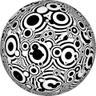
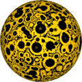

# TSL Textures


## Circle decor

This texture generates a wall or wallpaper decoration based on concentric
circles. Click on a snapshot to open it online.

<p class="gallery">

	<a class="style-block nocaption" href="../online/circle-decor.html?scale=2&grains=0.2&complexity=1&blur=0.2&color=0&background=16777215&seed=0">
		
	</a>

	<a class="style-block nocaption" href="../online/circle-decor.html?scale=0&grains=1&complexity=0.2&blur=0.07&color=16726958&background=16777215&seed=3040">
		
	</a>

	<a class="style-block nocaption" href="../online/circle-decor.html?scale=4&grains=1&complexity=0.2&blur=0.41&color=0&background=16770304&seed=0">
		
	</a>

</p>


### Code example

```js
import { circleDecor } from "tsl-textures";

model.material.colorNode = circleDecor ( {
	scale: 2,
	grains: 0.2,
	complexity: 1,
	blur: 0.2,
	color: new THREE.Color(0),
	background: new THREE.Color(16777215),
	seed: 0
} );
```


### Parameters

* `scale` &ndash; level of details of the pattern, higher value generates finer details, [0, 4]
* `grains` &ndash; side of additional smaller circles, [0,1]
* `complexity` &ndash; amount of nested concentric circles [0,2]
* `blur` &ndash; smoothing for circle edges [0,1]
* `color` &ndash; main color of the texture
* `background` &ndash; background color of tissue wrinkles
* `seed` &ndash; number for the random generator, each value generates specific pattern


### Online generator

[online/circle-decor.html](../online/circle-decor.html)


### Source

[src/circle-decor.js](https://github.com/boytchev/tsl-textures/blob/main/src/circle-decor.js)


		
<div class="footnote">
	<a href="../">Home</a>
</div>