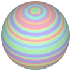
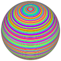
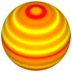

# TSL Textures


## Circles
This texture geenrates concentric horizonta circles. Click on a snapshot to open it online.

<p class="gallery">

	<a class="style-block nocaption" href="../online/circles.html?scale=2&variety=1&color=15786192&seed=0">
		
	</a>

	<a class="style-block nocaption" href="../online/circles.html?scale=3.6&variety=1&color=16759040&seed=0">
		
	</a>

	<a class="style-block nocaption" href="../online/circles.html?scale=2.112&variety=0.12&color=16772864&seed=7431">
		
	</a>

</p>


### Code example

```js
import { circles } from "tsl-textures/circles.js";

model.material.colorNode = circles ( {
	scale: 2,
	variety: 1,
	color: new THREE.Color(15786192),
	seed: 0
} );
```


### Parameters

The parameters of the texture generator are:

* `scale` &ndash; level of details of the pattern, higher value generates finer details, [0, 4]
* `variety` &ndash; hue variety of colors, [0, 1]
* `color` &ndash; main color
* `background` &ndash; secondary color
* `seed` &ndash; number for the random generator, each value generates specific pattern


### Online generator

[online/circles.html](../online/circles.html)


### Source

[src/circles.js](https://github.com/boytchev/tsl-textures/blob/main/src/circles.js)


<div class="footnote">
	<a href="../">Home</a>
</div>