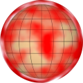

# TSL Textures


## Clouds
This texture renders clouds. The texture has alpha channel
to support transparency and opacity. Click on a snapshot to
open it online.

<p class="gallery">

	<a class="style-block nocaption" href="../online/clouds.html?scale=2&density=0.62&opacity=1&color=16777215&subcolor=10526896">
		
	</a>

	<a class="style-block nocaption" href="../online/clouds.html?scale=3.84&density=0.95&opacity=0.15&color=0&subcolor=16772864&seed=8318">
		
	</a>

	<a class="style-block nocaption" href="../online/clouds.html?scale=1.48&density=0.79&opacity=0.22&color=16711680&subcolor=16711909&seed=8318">
		
	</a>

</p>


### Code example

```js
import { clouds } from "tsl-textures/clouds.js";

model.material.colorNode = clouds ( {
	scale: 2,
	density: 0.5,
	opacity: 1,
	color: new THREE.Color(16777215),
	subcolor: new THREE.Color(10526896),
	seed: 0
} );

model.material.transparent = true;
model.material.opacity = 1;
model.material.side = THREE.DoubleSide;
model.material.opacityNode = clouds.opacity ( {
	scale: 2,
	density: 0.5,
	opacity: 1,
	color: new THREE.Color(16777215),
	subcolor: new THREE.Color(10526896),
	seed: 0
} );
```


### Parameters

* `scale` &ndash; level of details of the pattern, higher value generates finer details, [0, 4]
* `density` &ndash; density of clouds, [0,1]
* `opacity` &ndash; opacity of clouds, [0,1]
* `color` &ndash; color of clouds
* `subcolor` &ndash; secondary color for thin clouds


### Online generator

[online/clouds.html](../online/clouds.html)


### Source

[src/clouds.js](https://github.com/boytchev/tsl-textures/blob/main/src/clouds.js)

		
<div class="footnote">
	<a href="../">Home</a>
</div>