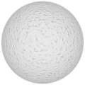
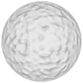
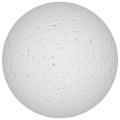

# TSL Textures


## Concrete

This texture immitates the grains of a rough concrete 
surface. It is designed to be used as normap map node on
a mesh with material with tangents. Click on a snapshot to
open it online.

<p class="gallery">

	<a class="style-block nocaption" href="../online/concrete.html?scale=2&density=0.5&bump=1.72&seed=0">
		
	</a>

	<a class="style-block nocaption" href="../online/concrete.html?scale=0&density=0.63&bump=2&seed=0">
		
	</a>

	<a class="style-block nocaption" href="../online/concrete.html?scale=2.6&density=0.14&bump=-2&seed=0">
		
	</a>

</p>


### Code example
```js
import { concrete } from "tsl-textures/concrete.js";

model.material.normalNode = concrete ( {
	scale: 2,
	density: 0.5,
	bump: 0.5,
	seed: 0
} );
```


### Parameters

* `scale` &ndash; level of details of the pattern, higher value generates finer details, [0, 4]
* `density` &ndash; pattern density [0,1]
* `bump` &ndash; bumpiness (height) of grains, negative bumps make dents [-2,2]
* `seed` &ndash; number for the random generator, each value generates specific pattern

### Online generator

[online/concrete.html](../online/concrete.html)


### Source

[src/concrete.js](https://github.com/boytchev/tsl-textures/blob/main/src/concrete.js)

		
<div class="footnote">
	<a href="../">Home</a>
</div>