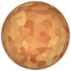
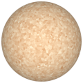
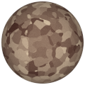

# TSL Textures


## Cork

This texture generates a [cork](https://en.wikipedia.org/wiki/Cork_(material))
material made of numerous randomly colored cork pieces.
Click on a snapshot to open it online.

<p class="gallery">

	<a class="style-block nocaption" href="../online/cork.html?scale=1&straight=1&noise=0.3&color=16773312&background=13664352&seed=0">
		
	</a>

	<a class="style-block nocaption" href="../online/cork.html?scale=3.04&straight=3&noise=0.81&color=16513003&background=15123875&seed=0">
		
	</a>

	<a class="style-block nocaption" href="../online/cork.html?cork?scale=0.76&straight=0&noise=0.27&color=15919577&background=7684667&seed=0">
		
	</a>

</p>


### Code template

```js
import { cork } from "tsl-textures/cork.js";

model.material.colorNode = cork ( {
	scale: 1,
	straight: 1,
	noise: 0.3,
	color: new THREE.Color(16773312),
	background: new THREE.Color(13664352),
	seed: 0
} );
```


### Parameters

* `scale` &ndash; level of details of the pattern, higher value generates smaller cork pieces, [0, 4]
* `staight` &ndash; straightness of cork pieces edges, [0, 3]
* `noise` &ndash; amound of additional small particles, [0, 1]
* `color` &ndash; one of the colors of the cork
* `background` &ndash; the other color of the cork
* `balanceWater` &ndash; ratio between deep water and shallow water, [0,1]
* `seed` &ndash; number for the random generator, each value generates specific pattern


### Online generator

[online/cork.html](../online/cork.html)


### Source

[src/cork.js](https://github.com/boytchev/tsl-textures/blob/main/src/cork.js)

		
<div class="footnote">
	<a href="../">Home</a>
</div>