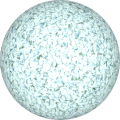

# TSL Textures


## Crumpled fabric

This texture recreates the wrinkles of a crumpled fabric. 
Click on a snapshot to open it online.

<p class="gallery">

	<a class="style-block nocaption" href="../online/crumpled-fabric.html?scale=2&pinch=0.5&color=11596031&subcolor=4210928&background=12288&seed=0">
		
	</a>

	<a class="style-block nocaption" href="../online/crumpled-fabric.html?scale=1.32&pinch=0.67&color=16774833&subcolor=15745088&background=12288&seed=0">
		
	</a>

	<a class="style-block nocaption" href="../online/crumpled-fabric.html?scale=3.372&pinch=0.278&color=16777215&subcolor=45463&background=2791077&seed=0">
		
	</a>

</p>


### Code example

```js
import { crumpledFabric } from "tsl-textures";

model.material.colorNode = crumpledFabric ( {
	scale: 2,
	pinch: 0.5,
	color: new THREE.Color(11596031),
	subcolor: new THREE.Color(4210928),
	background: new THREE.Color(12288),
	seed: 0
} );
```


### Parameters

* `scale` &ndash; level of details of the pattern, higher value generates finer details, [0, 4]
* `pinch` &ndash; pinch factor defining how thin are the crumples, [0, 1]
* `color` &ndash; main color of fabric
* `subcolor` &ndash; tint color for cumples' sides
* `background` &ndash; background color of shadow parts
* `seed` &ndash; number for the random generator, each value generates specific pattern


### Online generator

[online/crumpled-fabric.html](../online/crumpled-fabric.html)


### Source

[src/crumpled-fabric.js](https://github.com/boytchev/tsl-textures/blob/main/src/crumpled-fabric.js)


		
<div class="footnote">
	<a href="../">Home</a>
</div>