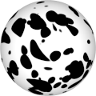

# TSL Textures


## Dalmatian spots

This texture generates dotted image which resenbles the spots of
[Dalmatian dog](https://en.wikipedia.org/wiki/Dalmatian_dog) coat.
Click on a snapshot to open it online.

<p class="gallery">

	<a class="style-block nocaption" href="../online/dalmatian-spots.html?scale=2&density=0.6&color=16777215&background=0&seed=0">
		
	</a>

	<a class="style-block nocaption" href="../online/dalmatian-spots.html?scale=0.384&density=0.852&color=16777215&background=0&seed=1307">
		
	</a>

	<a class="style-block nocaption" href="../online/dalmatian-spots.html?scale=1.564&density=0.748&color=15129522&background=16777215&seed=1307">
		
	</a>

</p>


### Code example

```js
import { dalmatianSpots } from "tsl-textures";

model.material.colorNode = dalmatianSpots ( {
	scale: 2,
	density: 0.6,
	color: new THREE.Color(16777215),
	background: new THREE.Color(0),
	seed: 0
} );
```


### Parameters

* `scale` &ndash; level of details of the pattern, higher value generates finer details, [0, 4]
* `density` &ndash; density of spots, [0,1]
* `color` &ndash; color of spots
* `background` &ndash; color of background
* `seed` &ndash; number for the random generator, each value generates specific pattern


### Online generator

[online/dalmatian-spots.html](../online/dalmatian-spots.html)


### Source

[src/dalmatian-spots.js](https://github.com/boytchev/tsl-textures/blob/main/src/dalmatian-spots.js)


		
<div class="footnote">
	<a href="../">Home</a>
</div>