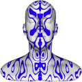
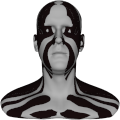

# TSL Textures


## Darth Maul

This texture recreates a pattern like the face decoration of 
[Darth Maul](https://en.wikipedia.org/wiki/Darth_Maul). The texture depends on
the vertice coordinates, so a different face surface will have different pattern
even when the texture parameters are the same. Click on a snapshot to open it online.

<p class="gallery">

	<a class="style-block nocaption" href="../online/darth-maul.html?scale=2&shift=0,-21.6,0.75&complexity=0.43&angle=60&distance=0.06&color=15745088&background=0&balance=0.16&seed=4106">
		
	</a>

	<a class="style-block nocaption" href="../online/darth-maul.html?scale=2&shift=0,-21.6,0.75&complexity=1&angle=70.2&distance=-2.1&color=16777215&background=7340283&balance=2&seed=4106">
		
	</a>

	<a class="style-block nocaption" href="../online/darth-maul.html?scale=0&shift=0,-29.6,-4&complexity=1&angle=72&distance=-2.46&color=5651776&background=14606046&balance=0.9999&seed=4106">
		
	</a>

</p>


### Code example

```js
import { darthMaul } from "tsl-textures";

model.material.colorNode = darthMaul ( {
	scale: 2,
	shift: new THREE.Vector3(0,0,0),
	complexity: 0,
	angle: 60,
	distance: 1.9,
	color: new THREE.Color(15745088),
	background: new THREE.Color(0),
	balance: 0,
	seed: 0
} );
```


### Parameters

* `position` &ndash; coordinates used to map texture, default is TSL `positionGeometry` node
* `scale` &ndash; level of details of the pattern, higher value generates finer details, [0, 4]
* `shift` &ndash; pattern shift in 3D, a vector, shift in X and Z directions appear as pan, shift in Y direction changes the variation of the pattern
* `complexity` &ndash; pattern complexity [0,1]
* `angle` &ndash; an angle in degrees for the lower edge of the pattern [0,90]
* `distance` &ndash; a shift factor for the lower edge of the pattern
* `color` &ndash; main color 
* `background` &ndash; color of background
* `balance` &ndash; balance between main and background color [0,1]
* `seed` &ndash; number for the random generator, each value generates specific pattern


### Online generator

[online/darth-maul.html](../online/darth-maul.html)


### Source

[src/darth-maul.js](https://github.com/boytchev/tsl-textures/blob/main/src/darth-maul.js)


		
<div class="footnote">
	<a href="../">Home</a>
</div>