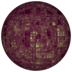

# TSL Textures


## Dyson sphere

This texture generates a possible fractal interpretation of a
[Dyson sphere](https://en.wikipedia.org/wiki/Dyson_sphere) &ndash;
an artificial megastracture around a star, porposed by
[Freeman Dyson](https://en.wikipedia.org/wiki/Freeman_Dyson).
Click on a snapshot to open it online.

<p class="gallery">

	<a class="style-block nocaption" href="../online/dyson-sphere.html?scale=2&complexity=2&variation=0&color=14542335&background=0&seed=0">
		
	</a>

	<a class="style-block nocaption" href="../online/dyson-sphere.html?scale=0&complexity=1&variation=0&color=42555&background=15400938&seed=0">
		
	</a>

	<a class="style-block nocaption" href="../online/dyson-sphere.html?scale=0&complexity=6&variation=0&color=13489576&background=9437297&seed=0">
		
	</a>

</p>


### Code template

```js
import { dysonSphere } from "tsl-textures/dyson-sphere.js";

model.material.colorNode = dysonSphere ( {
	scale: 2,
	complexity: 2,
	variation: 0,
	color: new THREE.Color(12636415),
	background: new THREE.Color(0),
	seed: 0
} );
```


### Parameters

* `scale` &ndash; level of details of the pattern, higher value generates smaller Dyson sphere details, [0, 4]
* `complexity` &ndash; number of levels of details, [0, 4]
* `color` &ndash; foreground color of the dyson-sphere
* `background` &ndash; background color of the dyson-sphere
* `seed` &ndash; number for the random generator, each value generates specific pattern


### Online generator

[online/dyson-sphere.html](../online/dyson-sphere.html)


### Source

[src/dyson-sphere.js](https://github.com/boytchev/tsl-textures/blob/main/src/dyson-sphere.js)

		
<div class="footnote">
	<a href="../">Home</a>
</div>