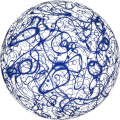
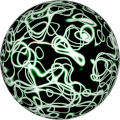
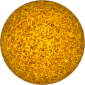

# TSL Textures


## Entangled
This texture renderes a ball of entangled lines or the
[lineae of Europa](https://en.wikipedia.org/wiki/Europa_(moon)#Lineae),
one of the Galilean moons of Jupiter. Click on a snapshot to
open it online.

<p class="gallery">

	<a class="style-block nocaption" href="../online/entangled.html?scale=0.72&density=10&color=3500473&background=16777215&seed=0">
		
	</a>

	<a class="style-block nocaption" href="../online/entangled.html?scale=0.64&density=6&color=16645629&background=6274431&seed=0">
		
	</a>

	<a class="style-block nocaption" href="../online/entangled.html?scale=2.4&density=16&color=16772096&background=14614528&seed=0">
		
	</a>

</p>


### Code example

```js
import { entangled } from "tsl-textures/entangled.js";

model.material.colorNode = entangled ( {
	scale: 2,
	density: 10,
	color: new THREE.Color(8256),
	background: new THREE.Color(16777215),
	seed: 0
} );
```


### Parameters

* `scale` &ndash; level of details of the pattern, higher value generates finer details, [0, 4]
* `density` &ndash; density of lines, [0,20]
* `color` &ndash; color of lines
* `background &ndash; color of background
* `seed` &ndash; number for the random generator, each value generates specific pattern


### Online generator

[online/entangled.html](../online/entangled.html)


### Source

[src/patterns/entangled.js](https://github.com/boytchev/tsl-textures/blob/main/src/entangled.js)


		
<div class="footnote">
	<a href="../">Home</a>
</div>