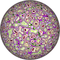
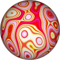
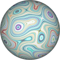

# TSL Textures


## Fordite

This texture generates [fordite stones](https://en.wikipedia.org/wiki/Fordite).
These are buildups of layers of paints cut across the layers. Click on
a snapshot to open it online.

<p class="gallery">

	<a class="style-block nocaption" href="../online/fordite.html?scale=2&color=0">
		
	</a>

	<a class="style-block nocaption" href="../online/fordite.html?scale=0.96&color=13549056">
		
	</a>

	<a class="style-block nocaption" href="../online/fordite.html?scale=0&color=13500619">
		
	</a>

</p>


### Code template

```js
import { fordite } from "tsl-textures/fordite.js";

model.material.colorNode = fordite ( {
	scale: 2,
	color: new THREE.Color(0),
	seed: 0,
} );
```


### Parameters

* `scale` &ndash; level of details of the pattern, higher value generates finer details, suggested range [0, 4]
* `color` &ndash; color added to the texture, this may shift the hue of the patter
* `seed` &ndash; number for the random generator, each value generates specific pattern


### Online generator

[online/fordite.html](../online/fordite.html)


### Source

[src/fordite.js](https://github.com/boytchev/tsl-textures/blob/main/src/fordite.js)


		
<div class="footnote">
	<a href="./">Home</a>
</div>	