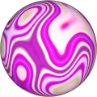

# TSL Textures


## Fordite

This texture generates [fordite stones](https://en.wikipedia.org/wiki/Fordite).
These are buildups of layers of paints cut across the layers. Click on
a snapshot to open it online.

<p class="gallery">

	<a class="style-block nocaption" href="../online/fordite.html?scale=2&color=0">
		
	</a>

	<a class="style-block nocaption" href="../online/fordite.html?scale=0.96&color=13549056">
		
	</a>

	<a class="style-block nocaption" href="../online/fordite.html?scale=0&color=13500619">
		
	</a>

</p>


### Code example

Code template of parameters with their default values.

```js
<script type="importmap">
  {
	"imports": {
		"three": "https://cdn.jsdelivr.net/npm/three@0.164.0/build/three.module.js",
		"three/nodes": "https://cdn.jsdelivr.net/npm/three@0.164.0/examples/jsm/nodes/Nodes.js",
		"tsl-textures/": "../src/"
	}
  }
</script>
	
import { fordite } from "tsl-textures/fordite.js";

model.material.colorNode = fordite ( { scale: 2, color: new THREE.Color(0), seed: 0 } );

```


### Parameters

The parameters of the texture generator are:

* `scale` &ndash; level of details of the pattern, higher value generates finer details, suggested range [0, 4]
* `color` &ndash; color added to the texture
* `seed` &ndash; identifier of texture's pattern


### Online generator

[online/fordite.html](../online/fordite.html)


### Source

[src/fordite.js](https://github.com/boytchev/tsl-textures/blob/main/src/fordite.js)


		
<div class="footnote">
	<a href="./">Home</a>
</div>