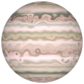
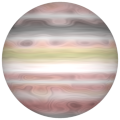
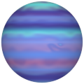

# TSL Textures


## Gas giant

This texture recreates the turbulent surface of [gas giants](https://en.wikipedia.org/wiki/Gas_giant)
planet like [Jupiter](https://en.wikipedia.org/wiki/Jupiter) and [Saturn](https://en.wikipedia.org/wiki/Saturn),
as well as [ice giants](https://en.wikipedia.org/wiki/Ice_giant) like [Uranus](https://en.wikipedia.org/wiki/Uranus)
and [Neptune](https://en.wikipedia.org/wiki/Neptune). Click on a snapshot to open it online.

<p class="gallery">

	<a class="style-block nocaption" href="../online/gas-giant.html?scale=1.28&turbulence=0.53&blur=0.6&colorA=16775408&colorB=16777215&colorC=15715786&seed=1756">
		
	</a>

	<a class="style-block nocaption" href="../online/gas-giant.html?scale=0&turbulence=1&blur=0.59&colorA=16777215&colorB=16774079&colorC=13697024&seed=831">
		
	</a>

	<a class="style-block nocaption" href="../online/gas-giant.html?scale=0.4&turbulence=0.35&blur=1&colorA=11652607&colorB=8900052&colorC=16711680&seed=7109">
		
	</a>

</p>


### Code template

```js
import { gasGiant } from "tsl-textures";

model.material.colorNode = gasGiant( {
	scale: 2,
	turbulence: 0.3,
	blur: 0.6,
	colorA: new THREE.Color(16775408),
	colorB: new THREE.Color(15788208),
	colorC: new THREE.Color(11509968),
	seed: 0
} );
```


### Parameters

* `position` &ndash; coordinates used to map texture, default is TSL `positionGeometry` node
* `scale` &ndash; level of details of the pattern, higher value generates finer details, [0, 4]
* `turbulence` &ndash; amount of turbulence of athmospheric currents, [0, 1]
* `blur` &ndash; blur of atmospheric currents, [0, 1]
* `colorA` &ndash; major color
* `colorB` &ndash; secondary color
* `colorC` &ndash; turbulence color
* `seed` &ndash; number for the random generator, each value generates specific pattern


### Online generator

[online/gas-giant.html](../online/gas-giant.html)


### Source

[src/gas-giant.js](https://github.com/boytchev/tsl-textures/blob/main/src/gas-giant.js)


		
<div class="footnote">
	<a href="../">Home</a>
</div>