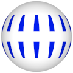

# TSL Textures


## Grid

This texture draws a spherical grid trying to maintain fixed width of
grid lines. Click on a snapshot to open it online.

<p class="gallery">

	<a class="style-block nocaption" href="../online/grid.html?countU=32&countV=16&thinness=0.8&color=0&background=16777215">
		
	</a>

	<a class="style-block nocaption" href="../online/grid.html?countU=100&countV=50&thinness=0.3&color=16763136&background=0">
		
	</a>

	<a class="style-block nocaption" href="../online/grid.html?countU=14&countV=4&thinness=0.09&color=16711422&background=23278">
		
	</a>

</p>


### Code example

```js
import { grid } from "tsl-textures";

model.material.colorNode = grid ( {
	countU: 32,
	countV: 16,
	thinness: 0.8,
	color: new THREE.Color(0),
	background: new THREE.Color(16777215)
} );
```


### Parameters

* `countU` &ndash; number of horizontal grid cells, [6,100]
* `countV` &ndash; number of vertical grid cells, [3,50]
* `thinness` &ndash; relative width of lines, [0,1]
* `color` &ndash; color of lines
* `background` &ndash; color of background


### Online generator

[online/grid.html](../online/grid.html)


### Source

[src/grid.js](https://github.com/boytchev/tsl-textures/blob/main/src/grid.js)


		
<div class="footnote">
	<a href="../">Home</a>
</div>