# TSL Textures


## Halftone

This texture enforces halftone pattern by keeping some part of the object surface
and discarding other parts. With the attunuation parameter it is possible to 
adjust pattern size to distance from the screen. To combine the texture with
a model coloring, it must be added to the color node. Click on a snapshot to open it online.

<p class="gallery">

	<a class="style-block nocaption" href="../online/halftone.html?scale=2&radius=0.5&pattern=1&attenuation=0&near=6&far=14">
		
	</a>

	<a class="style-block nocaption" href="../online/halftone.html?scale=1.008&radius=0.14&pattern=10&attenuation=0&near=6&far=14">
		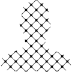
	</a>

	<a class="style-block nocaption" href="../online/halftone.html?scale=3.06&radius=1.7&pattern=8&attenuation=1&near=5.4&far=10.6">
		
	</a>

</p>


### Code example

```js
import { halftone } from "tsl-textures";

model.material.colorNode = halftone ( {
	scale: 2,
	radius: 0.5,
	pattern: 1,
	attenuation: 0,
	near: 6,
	far: 14
} );
```


### Parameters

* `position` &ndash; coordinates used to map texture, default is TSL `screenCoordinate` node
* `scale` &ndash; level of details of the pattern, higher value generates finer details, [0, 4]
* `radius` &ndash; size of dots in the pattern , [0,2]
* `pattern` &ndash; an index of the pattern to use, [0,10]
* `attenuation` &ndash; in integer flag whether dot size attenuates with distance [0 or 1]
* `near` &ndash; distance at which the pattern starts to appear, valid only if attenuation is 1
* `far` &ndash; distance at which the pattern makes the model disappear, valid only if attenuation is 1
* `color` &ndash; main color of the texture, default is TSL `vertexColor()`
* `positionView` &ndash; screen-based coordinates, default is TSL `positionView` node


### Notes

When `attenuation` is 0, the pattern is regular and the size is independent on depth.

When `attenuation` is 1, the `radius` of the pattern is multiplied by the relative
location with in the interval [`near`,`far`]. If `near`<`far` then the objects
disappear if they are too far. If `near`>`far` then the objects disappear if they
are too close.

Currently supported are these patterns (white parts are transparent). Patterns
marked by \* require specific value of the `radius`, otherwise they diverge too
circles.

| Index  | Name | Snapshot |
| --- | --- | --- |
| 0  | grid  | 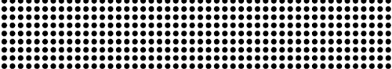 |
| 1  | diagonal  | 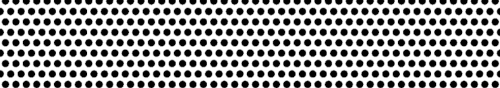 |
| 2\*  | checkerboard  | 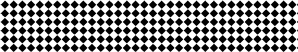 |
| 3\*  | diagonal/x  | 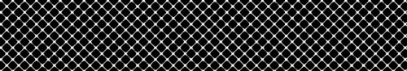 |
| 4\*  | grid/x  | 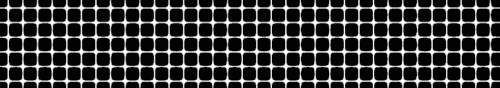 |
| 5  | square  |  |
| 6  | square/n  | 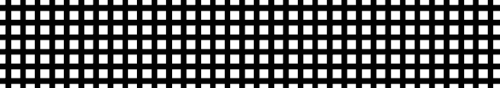 |
| 7  | vertical  | 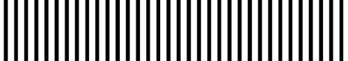 |
| 8  | horizontal  | 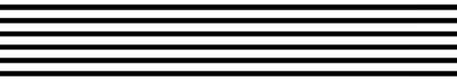 |
| 9\*  | grid/xn  | 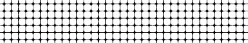 |
| 10\*  | diagonal/xn  | 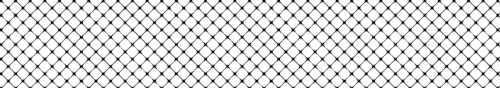 |


### Online generator

[online/halftone.html](../online/halftone.html)


### Source

[src/halftone.js](https://github.com/boytchev/tsl-textures/blob/main/src/halftone.js)


		
<div class="footnote">
	<a href="../">Home</a>
</div>