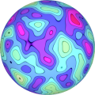
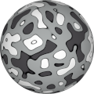
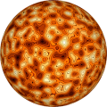

# TSL Textures


## Isolayers

This texture renders looped concentric lines like
[contour lines](https://en.wikipedia.org/wiki/Contour_line)
found in topographic and meteorological maps. Additionally
the layers are colored in discrete gradient. Click on
a snapshot to open it online.

<p class="gallery">

	<a class="style-block nocaption" href="../online/isolayers.html?scale=2&layers=10&edge=0.5&darkness=0&color=16777200&background=16728128&seed=0">
		
	</a>

	<a class="style-block nocaption" href="../online/isolayers.html?scale=2.28&layers=4&edge=0.5&darkness=1&color=16777215&background=13618123&seed=0">
		
	</a>

	<a class="style-block nocaption" href="../online/isolayers.html?scale=3&layers=10&edge=1&darkness=0.03&color=16776170&background=8136192&seed=0">
		
	</a>

</p>


### Code example

```js
import { isolayers } from "tsl-textures";

model.material.colorNode = isolayers ( {
	scale: 2,
	layers: 10,
	edge: 0.5,
	darkness: 0,
	color: new THREE.Color(16777200),
	background: new THREE.Color(16728128),
	seed: 0
} );
```


### Parameters

* `position` &ndash; coordinates used to map texture, default is TSL `positionGeometry` node
* `scale` &ndash; level of details of the pattern, higher value generates finer details, [0, 4]
* `layers` &ndash; number of layers, [3,30]
* `edge` &ndash; thickness of contour shadows, [0,1]
* `darkness` &ndash; darkness factor for lower levels, [0,1]
* `color` &ndash; color of top layers
* `background` &ndash; color of bottom layers
* `seed` &ndash; number for the random generator, each value generates specific pattern


### Online generator

[online/isolayers.html](../online/isolayers.html)


### Source

[src/isolayers.js](https://github.com/boytchev/tsl-textures/blob/main/src/isolayers.js)


		
<div class="footnote">
	<a href="../">Home</a>
</div>