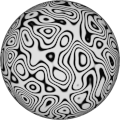
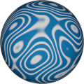

# TSL Textures


## Isolines

This texture renders looped concentric lines like
[contour lines](https://en.wikipedia.org/wiki/Contour_line)
found in topographic and meteorological maps. Click on
a snapshot to open it online.

<p class="gallery">

	<a class="style-block nocaption" href="../online/isolines.html?scale=1&density=40&blur=0.3&thinness=0.6&color=16777215&background=0">
		
	</a>

	<a class="style-block nocaption" href="../online/isolines.html?scale=0.2&density=40&blur=0.3&thinness=0.17&color=14606046&background=2518686">
		
	</a>

	<a class="style-block nocaption" href="../online/isolines.html?scale=0&density=14.925&blur=0.01&thinness=0.06&color=12058624&background=16777215">
		
	</a>

</p>


### Code example

Code template of parameters with their default values.

```js
import { isolines } from "tsl-textures/isolines.js";

model.material.colorNode = isolines ( {
	scale: 2,
	density: 40,
	blur: 0.3,
	thinnes: 0.6,
	color: new THREE.Color(16777215),
	background: new THREE.Color(0),
	seed: 0
} );

```


### Parameters

* `scale` &ndash; level of details of the pattern, higher value generates finer details, [0, 4]
* `density` &ndash; density of lines, [1,200]
* `blur` &ndash; smoothness of lines edges, [0,1]
* `thinness` &ndash; relative thinness of lines, [0,1]
* `color` &ndash; color of lines
* `background` &ndash; color of background


### Online generator

[online/isolines.html](../online/isolines.html)


### Source

[src/patterns/isolines.js](https://github.com/boytchev/tsl-textures/blob/main/src/isolines.js)


		
<div class="footnote">
	<a href="#" onclick="window.history.back(); return false;">Back</a>
</div>