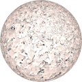
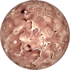
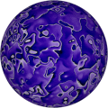

# TSL Textures


## Karst rock

This texture imitates the porous nature of [karst rocks](https://en.wikipedia.org/wiki/Karst)
caused by erosion. Click on a snapshot to open it online.

<p class="gallery">

	<a class="style-block nocaption" href="../online/karst-rock.html?scale=2&color=16774384&background=13684944&seed=0">
		
	</a>

	<a class="style-block nocaption" href="../online/karst-rock.html?scale=1.04&color=14860981&background=10616832&seed=0">
		
	</a>

	<a class="style-block nocaption" href="../online/karst-rock.html?scale=1.16&color=8192200&background=16777215&seed=7671">
		
	</a>

</p>


### Code example

```js
import { karstRock } from "tsl-textures/karst-rock.js";

model.material.colorNode = karstRock ( {
	scale: 2,
	color: new THREE.Color(16774384),
	background: new THREE.Color(13684944),
	seed: 0
} );
```


### Parameters

* `scale` &ndash; level of details of the pattern, higher value generates finer details, [0, 4]
* `color` &ndash; color of lines
* `background` &ndash; color of background
* `seed` &ndash; number for the random generator, each value generates specific pattern


### Online generator

[online/karst-rock.html](../online/karst-rock.html)


### Source

[src/karst-rock.js](https://github.com/boytchev/tsl-textures/blob/main/src/karst-rock.js)


		
<div class="footnote">
	<a href="../">Home</a>
</div>