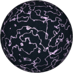
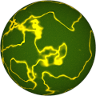

# TSL Textures


## Marble

This texture renders marble surface with threads in it.
Click on a snapshot to open it online.

<p class="gallery">

	<a class="style-block nocaption" href="../online/marble.html?scale=1.2&thinness=5&noise=0.3&color=4539859&background=15792383">
		
	</a>

	<a class="style-block nocaption" href="../online/marble.html?scale=1.564&thinness=6.5&noise=1&color=15523058&background=4215133">
		
	</a>

	<a class="style-block nocaption" href="../online/marble.html?scale=0.616&thinness=6.3&noise=1&color=16772864&background=7378466">
		
	</a>

</p>


### Code example

```js
import { marble } from "tsl-textures";

model.material.colorNode = marble ( {
	scale: 1.2,
	thinness: 5,
	noise: 0.3,
	color: new THREE.Color(4539859),
	background: new THREE.Color(15792383),
	seed: 0
} );
```


### Parameters

* `scale` &ndash; level of details of the pattern, higher value generates finer details, [0, 4]
* `thinness` &ndash; thinness of threads, [0,10]
* `noise` &ndash; noise of background [0,1]
* `color` &ndash; color of lines
* `background` &ndash; color of background
* `seed` &ndash; number for the random generator, each value generates specific pattern

### Online generator

[online/marble.html](../online/marble.html)


### Source

[src/marble.js](https://github.com/boytchev/tsl-textures/blob/main/src/marble.js)

		
<div class="footnote">
	<a href="../">Home</a>
</div>