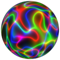
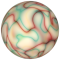

# TSL Textures


## Neon lights
This texture generates plasma-like neon ligts. It overlaps
up to three neon colors. Click on a snapshot to open it online.

<p class="gallery">

	<a class="style-block nocaption" href="../online/neon-lights.html?scale=1.5&thinness=0.8&mode=0&colorA=16711680&colorB=65280&colorC=255&background=0">
		
	</a>

	<a class="style-block nocaption" href="../online/neon-lights.html?scale=0.88&thinness=0.66&mode=0&colorA=15198183&colorB=16711895&colorC=903374&background=29183">
		
	</a>

	<a class="style-block nocaption" href="../online/neon-lights.html?scale=1.44&thinness=0.92&mode=1&colorA=13069677&colorB=8378056&colorC=852066&background=16709611">
		
	</a>

</p>


### Code template

```js
import { neonLights } from "tsl-textures";

model.material.colorNode = neonLights ( {
	scale: 1.5,
	thinness: 0.8,
	mode: 0,
	colorA: new THREE.Color(16711680),
	colorB: new THREE.Color(65280),
	colorC: new THREE.Color(255),
	background: new THREE.Color(0),
	seed: 0
} );
```


### Parameters

* `scale` &ndash; level of details of the pattern, higher value generates finer details, [0, 4]
* `thinness` &ndash; thinness of lights, [0,1]
* `mode` &ndash; additive or subtractive blending
* `colorA` &ndash; first neon color
* `colorB` &ndash; second neon color
* `colorC` &ndash; third neon color
* `background` &ndash; background color
* `seed` &ndash; number for the random generator, each value generates specific pattern

In additive mode:
* neon colors are added to the background color
* background color is supposed to be dark
* a neon color is turned off when it is black

In subtractive mode:
* neon colors are subtracted from the background color
* background color is supposed to be light
* a neon color is turned off when it is white


### Online generator

[online/neon-lights.html](../online/neon-lights.html)

### Source

[src/neon-lights.js](https://github.com/boytchev/tsl-textures/blob/main/src/neon-lights.js)


		
<div class="footnote">
	<a href="../">Home</a>
</div>