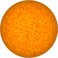
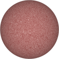

# TSL Textures


## Photosphere
This texture renderes the convection cells of plasma on the
surface of a star. These granules are a phenomenon of the
[photosphere](https://en.wikipedia.org/wiki/Photosphere).
Click on a snapshot to open it online.

<p class="gallery">

	<a class="style-block nocaption" href="../online/photosphere.html?scale=2&color=16776960&background=16711680">
		
	</a>

	<a class="style-block nocaption" href="../online/photosphere.html?scale=1.044&color=16777215&background=4686264">
		
	</a>
	
	<a class="style-block nocaption" href="../online/photosphere.html?scale=2.932&color=15787747&background=11141120">
		
	</a>

</p>


### Code example

```js
import { photosphere } from "tsl-textures/photosphere.js";

model.material.colorNode = photosphere ( {
	scale: 2,
	color: new THREE.Color(16776960),
	background: new THREE.Color(16711680),
	seed: 0
} );
```


### Parameters

* `scale` &ndash; level of details of the pattern, higher value generates finer details, [0, 4]
* `color` &ndash; color of hot areas
* `background` &ndash; color of background
* `seed` &ndash; number for the random generator, each value generates specific pattern


### Online generator

[online/photosphere.html](../online/photosphere.html)


### Source

[src/photosphere.js](https://github.com/boytchev/tsl-textures/blob/main/src/photosphere.js)

		
<div class="footnote">
	<a href="../">Home</a>
</div>