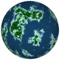

# TSL Textures


## Planet

This texture generates the surface colors of a planet. There
are six types of terrains groups into three clusters: water
area, land area and highlang (mountaneous) area. The
generated texture is for color maps. Click on a snapshot to
open it online.

<p class="gallery">

	<a class="style-block nocaption" href="../online/planet.html?scale=1.72&iterations=5&levelSea=0.3&levelMountain=0.464&balanceWater=0.344&balanceSand=0.2&balanceSnow=0.8&colorDeep=4948895&colorShallow=12642550&colorBeach=16776680&colorGrass=8772274&colorForest=30720&colorSnow=16318463&seed=6235">
		
	</a>

	<a class="style-block nocaption" href="../online/planet.html?scale=1.72&iterations=5&levelSea=0.3&levelMountain=0.464&balanceWater=0.344&balanceSand=0.2&balanceSnow=0.8&colorDeep=15790320&colorShallow=11842740&colorBeach=16777215&colorGrass=16777215&colorForest=16777215&colorSnow=16777215&seed=7632">
		
	</a>

	<a class="style-block nocaption" href="../online/planet.html?scale=1.8&iterations=7&levelSea=0.147&levelMountain=0.464&balanceWater=0.628&balanceSand=0.409&balanceSnow=0.803&colorDeep=16774656&colorShallow=14640426&colorBeach=0&colorGrass=10427420&colorForest=16621056&colorSnow=16770304&seed=2450">
		
	</a>

</p>


### Code template

```js
import { planet } from "tsl-textures";

model.material.colorNode = planet ( {
	scale: 2,
	iterations: 5,
	levelSea: 0.3,
	levelMountain: 0.7,
	balanceWater: 0.3,
	balanceSand: 0.2,
	balanceSnow: 0.8,
	colorDeep: new THREE.Color(4948895),
	colorShallow: new THREE.Color(12642550),
	colorBeach: new THREE.Color(16776680),
	colorGrass: new THREE.Color(8772274),
	colorForest: new THREE.Color(30720),
	colorSnow: new THREE.Color(16318463),
	seed: 0
} );
```


### Parameters

* `scale` &ndash; level of details of the pattern, higher value generates smaller but more numerous lands, [0, 4]
* `iterations` &ndash; number of granulations of terrain, [0, 10]
* `levelSea` &ndash; relative altitude for sea level, higer value generates more water [0, 1]
* `levelMountain` &ndash; relative altitude for where a mountain starts, higer value generates less mountains [0, 1]
* `seed` &ndash; number for the random generator, each value generates specific pattern

Water parameters:

* `colorDeep` &ndash; color of deep ocean water
* `colorShallow` &ndash; color of shallow coastal water
* `balanceWater` &ndash; ratio between deep water and shallow water, [0,1]

Land parameters:

* `colorBeach` &ndash; color of beach sand
* `colorGrass` &ndash; color of low land grass
* `balanceSand` &ndash; ratio between sand and grass, [0,1]

Highland parameters:

* `colorForest` &ndash; color of forest part of highlangs
* `colorSnow` &ndash; color of snowy mountains peaks
* `balanceSnow` &ndash; ratio between forest and snow, [0,1]


### Online generator

[online/planet.html](../online/planet.html)


### Source

[src/planet.js](https://github.com/boytchev/tsl-textures/blob/main/src/planet.js)

		
<div class="footnote">
	<a href="../">Home</a>
</div>