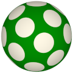

# TSL Textures


## Polka dots

This texture arranges dots similar to the [Polka dots](https://en.wikipedia.org/wiki/Polka_dot)
in fashion design. The arrangement of dots is similar to the sunflower seeds
arragement (also known as Fibonacci lattice). Click on a snapshot to open it online.

<p class="gallery">

	<a class="style-block nocaption" href="../online/polka-dots.html?count=2&size=0.57&blur=0.25&color=0&background=16777215">
		
	</a>

	<a class="style-block nocaption" href="../online/polka-dots.html?count=1.359&size=0.75&blur=0.25&color=15986920&background=48128">
		
	</a>

	<a class="style-block nocaption" href="../online/polka-dots.html?count=2.619&size=0.53&blur=0.7&color=16580271&background=15728640">
		
	</a>

</p>


### Code example

```js
import { polkaDots } from "tsl-textures";

model.material.colorNode = polkaDots ( {
	count: 4.26,
	size: 0.34,
	blur: 0.22,
	color: new THREE.Color(0),
	background: new THREE.Color(16777215)
} );
```


### Parameters

* `count` &ndash; number of dots is 10*<sup>count</sup>*, [1,4]
* `size` &ndash; relative dot size, [0,1]
* `blur` &ndash; smoothness of dots edges, [0,1]
* `color` &ndash; color of dots, default 0x000000 (black)
* `background` &ndash; color of background, default 0xFFFFFF (white)


### Online generator

[online/polka-dots.html](../online/polka-dots.html)


### Source

[src/polka-dots.js](https://github.com/boytchev/tsl-textures/blob/main/src/polka-dots.js)

		
<div class="footnote">
	<a href="../">Home</a>
</div>