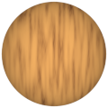
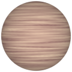
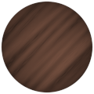

# TSL Textures


## Processed wood

This texture attempts imitate the pattern of some types of processed wood,
also kown as [engineered wood](https://en.wikipedia.org/wiki/Engineered_wood).
Click on a snapshot to open it online.

<p class="gallery">

	<a class="style-block nocaption" href="../online/processed-wood.html?scale=2&length=4&strength=0.3&angle=0&color=7348256&background=15782048&seed=0">
		
	</a>

	<a class="style-block nocaption" href="../online/processed-wood.html?scale=2.54&length=19&strength=0.48&angle=90&color=12295838&background=15984599&seed=6631">
		
	</a>

	<a class="style-block nocaption" href="../online/processed-wood.html?scale=1.08&length=20&strength=0.64&angle=45&color=11374978&background=0&seed=561">
		
	</a>

</p>


### Code example

```js
import { processedWood } from "tsl-textures/processed-wood.js";

model.material.colorNode = processedWood ( {
	scale: 2,
	length: 4,
	strength: 0.3,
	angle: 0,
	color: new THREE.Color(7348256),
	background: new THREE.Color(15782048),
	seed: 0
} );
```


### Parameters

* `scale` &ndash; level of details of the pattern, higher value generates finer details, [1, 4]
* `length` &ndash; length of the fibers, [0, 20]
* `stregth` &ndash; itesity of fibers, [0, 1]
* `angle` &ndash; angle of the fiber pattern, in degrees, [-90, 90]
* `color` &ndash; color of fibers
* `background` &ndash; backgroud wood color
* `seed` &ndash; number for the random generator, each value generates specific pattern


### Online generator

[online/processed-wood.html](../online/processed-wood.html)


### Source

[src/processed-wood.js](https://github.com/boytchev/tsl-textures/blob/main/src/processed-wood.js)


<div class="footnote">
	<a href="../">Home</a>
</div>