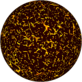

# TSL Textures


## Protozoa

This texture generates a pool full of [protozoa organisms](https://en.wikipedia.org/wiki/Protozoa).
The position and shape of protozoa depend on the viewing position. Thus a mere
rotation of the scene or the camera induces motion of the protozoa. Click on
a snapshot to open it online.

<p class="gallery">

	<a class="style-block nocaption" href="../online/protozoa.html?scale=1.5&fat=0.7&amount=0.4&color=10526880&subcolor=14739711&background=15792383&seed=0">
		
	</a>

	<a class="style-block nocaption" href="../online/protozoa.html?scale=0.16&fat=0.92&amount=0.93&color=16777215&subcolor=0&background=15859697&seed=6352">
		
	</a>

	<a class="style-block nocaption" href="../online/protozoa.html?scale=2.44&fat=0.55&amount=0.1&color=16645888&subcolor=16580608&background=6881280&seed=6352">
		
	</a>

</p>


### Code example

```js
import { protozoa } from "tsl-textures";

model.material.colorNode = protozoa ( {
	scale: 1.5,
	fat: 0.7,
	amount: 0.4,
	color: new THREE.Color(10526880),
	subcolor: new THREE.Color(14739711),
	background: new THREE.Color(15792383),
	seed: 0
} );
```


### Parameters

* `scale` &ndash; level of details of the pattern, higher value generates finer details, [0, 4]
* `fat` &ndash; the size of the largest protozoa, [0, 1]
* `amount` &ndash; amount of protozoa organisms, [0, 1]
* `color` &ndash; color of protozoa
* `subcolor` &ndash; additional, secondary color of protozoa
* `background` &ndash; color of pool background
* `seed` &ndash; number for the random generator, each value generates specific pattern


### Online generator

[online/protozoa.html](../online/protozoa.html)


### Source

[src/protozoa.js](https://github.com/boytchev/tsl-textures/blob/main/src/protozoa.js)


<div class="footnote">
	<a href="../">Home</a>
</div>