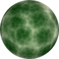
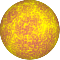
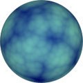

# TSL Textures


## Reticular veins

This texture generates reticular veins of plant leaves. These vains
are collectivey known as reticulate venation &ndash; one of the [leaf venation patterns](https://en.wikipedia.org/wiki/Leaf#Venation).
Click on a snapshot to open it online.

<p class="gallery">

	<a class="style-block nocaption" href="../online/reticular-veins.html?scale=0&reticulation=5&strength=0.2&organelles=0.2&color=16777200&background=2129952&seed=8680">
		
	</a>

	<a class="style-block nocaption" href="../online/reticular-veins.html?scale=0&reticulation=10&strength=1&organelles=0.45&color=16774656&background=14917792&seed=2075">
		
	</a>

	<a class="style-block nocaption" href="../online/reticular-veins.html?scale=0&reticulation=3.84&strength=0.22&organelles=0.25&color=21940&background=11394517&seed=4039">
		
	</a>

</p>


### Code template

```js
import { reticularVeins } from "tsl-textures";

model.material.colorNode = reticularVeins ( {
	scale: 2,
	reticulation: 5,
	strength: 0.2,
	organelles: 0.2,
	color: new THREE.Color(16777200),
	background: new THREE.Color(2129952),
	seed: 0
} );
```


### Parameters

* `position` &ndash; coordinates used to map texture, default is TSL `positionGeometry` node
* `scale` &ndash; level of details of the pattern, higher value generates finer details, [0, 4]
* `reticulation` &ndash; the density of the net of veins, [2,10]
* `strength` &ndash; strength of reticular veins, [0,1]
* `organelles` &ndash; strength of organelles of cells, [0,1]
* `color` &ndash; main color of veins
* `background` &ndash; color of leaf
* `seed` &ndash; number for the random generator, each value generates specific pattern


### Online generator

[online/reticular-veins.html](../online/reticular-veins.html)


### Source

[src/reticular-veins.js](https://github.com/boytchev/tsl-textures/blob/main/src/reticular-veins.js)


		
<div class="footnote">
	<a href="../">Home</a>
</div>