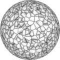
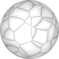
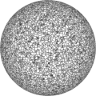

# TSL Textures


## Roman paving

This texture draw tightly packed irrecular polygons imitating ancient Rome
[crazy paving](https://en.wikipedia.org/wiki/Crazy_paving). Click on a snapshot
to open it online.

<p class="gallery">

	<a class="style-block nocaption" href="../online/roman-paving.html?scale=2&depth=0.5&seed=0">
		
	</a>

	<a class="style-block nocaption" href="../online/roman-paving.html?scale=0.72&depth=0.21&seed=0">
		
	</a>

	<a class="style-block nocaption" href="../online/roman-paving.html?scale=3.08&depth=0.59&seed=0">
		
	</a>

</p>


### Code template

```js
import { romanPaving } from "tsl-textures";

model.material.colorNode = romanPaving ( {
	scale: 2,
	depth: 0.5,
	seed: 0
} );
```


### Parameters

* `position` &ndash; coordinates used to map texture, default is TSL `positionGeometry` node
* `scale` &ndash; level of details of the pattern, higher value generates finer details, [0, 4]
* `depth` &ndash; depth of stone pavement and size of gaps between stones, [0, 1]
* `seed` &ndash; number for the random generator, each value generates specific pattern


### Online generator

[online/roman-paving.html](../online/roman-paving.html)


### Source

[src/roman-paving.js](https://github.com/boytchev/tsl-textures/blob/main/src/roman-paving.js)


		
<div class="footnote">
	<a href="../">Home</a>
</div>