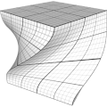
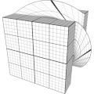
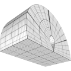

# TSL Textures


## Rotator

This texture deforms a shape by rotating part of it vertices. The rotation is
defined as YXZ rotation of Euler angles around a 3D pivot point used as rotation
center.

The selection of affected vertices is set by a imaginary thick planar
layer. Vertices "below" the layer are not affected, vertices above the layer are
fully affected. Vertices inside the layer are gradually affected depending on
how close they are to the "bottom" or the "top" of the layer. The layer is
defined by its own pivot point, rotation agles and width.

Hint: use the `show` checkbox of the online generator to visualize the layer.

<p class="gallery">

	<a class="style-block nocaption" href="../online/rotator.html?angles=0,1.26,0&center=0,0,0&selectorCenter=0,0,0&selectorAngles=0,0&selectorWidth=2">
		
	</a>

	<a class="style-block nocaption" href="../online/rotator.html?angles=0,0,1.57&center=0,0,0&selectorCenter=0,0,0&selectorAngles=1.59,0&selectorWidth=1.0569">
		
	</a>

	<a class="style-block nocaption" href="../online/rotator.html?angles=0,0,-3.14&center=1,0,0&selectorCenter=0,0,0&selectorAngles=0,0&selectorWidth=2">
		
	</a>

</p>


### Code template

```js
import * as THREE from "three";
import { rotator } from "tsl-textures/rotator.js";

model.material.positionNode = rotator ( {
	angles: new THREE.Vector3(0,0,0),
	center: new THREE.Vector3(0,0,0),
	selectorCenter: new THREE.Vector3(0,0,0),
	selectorAngles: new THREE.Vector2(0,0),
	selectorWidth: 2
} );

model.material.normalNode = rotator.normal ( {
	angles: new THREE.Vector3(0,0,0),
	center: new THREE.Vector3(0,0,0),
	selectorCenter: new THREE.Vector3(0,0,0),
	selectorAngles: new THREE.Vector2(0,0),
	selectorWidth: 2
} );
```


### Parameters

* `angles(x,y,z)` &ndash; Euler angles for rotation of vertices (in radians)
* `center(x,y,z)` &ndash; 3D pivot point used for rotation
* `selectorAngles(φ,θ)` &ndash; spherical coordinates angles for rotation of the selection layer, φ&in;[0, &pi;], θ&in;[-2&pi;, 2&pi;]
* `selectorCenter(x,y,z)` &ndash; 3D pivot point for the selection layer
* `selectorWidth` &ndash; number for the selection layer width, [0.1, 4]


### Online generator

[online/rotator.html](../online/rotator.html)


### Source

[src/rotator.js](https://github.com/boytchev/tsl-textures/blob/main/src/rotator.js)


		
<div class="footnote">
	<a href="../">Home</a>
</div>