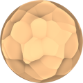
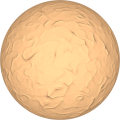
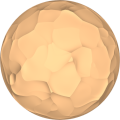

# TSL Textures


## Rough clay

This texture recreates the rough clay design. It does not change vertex position,
it only imitates the surface with a normal map. Click on a snapshot to open it online.

<p class="gallery">

	<a class="style-block nocaption" href="../online/rough-clay.html?scale=1.676&bump=1.96&curvature=0.12&seed=0">
		
	</a>

	<a class="style-block nocaption" href="../online/rough-clay.html?scale=3.56&bump=0.58&curvature=1&seed=0">
		
	</a>

	<a class="style-block nocaption" href="../online/rough-clay.html?scale=1.916&bump=1.02&curvature=0.56&seed=2834">
		
	</a>

</p>


### Code template

```js
import { roughClay } from "tsl-textures/rough-clay.js";

model.material.normalNode = roughClay ( {
	scale: 2,
	bump: 0.5,
	curvature: 0.2,
	seed: 0
} );
```


### Parameters

* `scale` &ndash; level of details of the pattern, higher value generates finer details, [0, 4]
* `bump` &ndash; bumpiness of the pattern, [0, 2]
* `curvature` &ndash; curvature of clay strokes borders, [0, 1]
* `seed` &ndash; number for the random generator, each value generates specific pattern


### Online generator

[online/rough-clay.html](../online/rough-clay.html)


### Source

[src/rough-clay.js](https://github.com/boytchev/tsl-textures/blob/main/src/rough-clay.js)


		
<div class="footnote">
	<a href="../">Home</a>
</div>