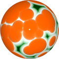
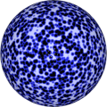

# TSL Textures


## Runny eggs

This texture imitates runny eggs. The calculation of this texture is heavy,
so a WebGPU support in the browser is essential. There are three texture functions -
for the color, for the normal vector and for the roughness.

Click on a snapshot to open it online.

<p class="gallery">

	<a class="style-block nocaption" href="../online/runny-eggs.html?scale=0.8&sizeYolk=0.2&sizeWhite=0.7&colorYolk=16753920&colorWhite=16777215&colorBackground=13882323&seed=0">
		
	</a>

	<a class="style-block nocaption" href="../online/runny-eggs.html?scale=0.6&sizeYolk=0.41&sizeWhite=0.7&colorYolk=16753920&colorWhite=16777215&colorBackground=47183&seed=4733">
		
	</a>

	<a class="style-block nocaption" href="../online/runny-eggs.html?scale=2.64&sizeYolk=0.24&sizeWhite=0.43&colorYolk=0&colorWhite=12007&colorBackground=12238581&seed=4733">
		
	</a>

</p>


### Code template

```js
import { runnyEggs } from "tsl-textures/runny-eggs.js";

var options = {
	scale: 2,
	sizeYolk: 0.2,
	sizeWhite: 0.7,
	colorYolk: new THREE.Color(16753920),
	colorWhite: new THREE.Color(16777215),
	colorBackground: new THREE.Color(13882323),
	seed: 0
};

model.material.colorNode = runnyEggs( options );
model.material.normalNode = runnyEggs.normal( options );
model.material.roughnessNode = runnyEggs.roughness( options );
```


### Parameters

* `scale` &ndash; level of details of the pattern, higher value generates finer details, [0, 4]
* `sizeYolk` &ndash; size of the eggs yolks, [0, 1]
* `sizeWhite` &ndash; size of the eggs whites, [0, 1]
* `colorYolk` &ndash; yolk color
* `colorWhite` &ndash; egg whites' color
* `colorBackground` &ndash; color of background under the eggs
* `seed` &ndash; number for the random generator, each value generates specific pattern


### Online generator

[online/runny-eggs.html](../online/runny-eggs.html)


### Source

[src/runny-eggs.js](https://github.com/boytchev/tsl-textures/blob/main/src/runny-eggs.js)


		
<div class="footnote">
	<a href="../">Home</a>
</div>