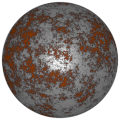
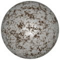
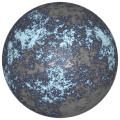

# TSL Textures


## Rust

This texture generates a rust pattern. Depending on colors,
it may also look like frost. The texture has opacity layer.
Click on a snapshot to open it online.

<p class="gallery">

	<a class="style-block nocaption" href="../online/rust.html?scale=2&iterations=8&amount=-0.3&opacity=0.5&noise=0.5&noiseScale=0.5&color=12615680&background=32&seed=0">
		
	</a>

	<a class="style-block nocaption" href="../online/rust.html?scale=10.5&iterations=7&amount=-0.18&opacity=0.26&noise=0&noiseScale=0.27&color=8148992&background=15988468&seed=0">
		
	</a>

	<a class="style-block nocaption" href="../online/rust.html?scale=0&iterations=9&amount=-0.38&opacity=0.26&noise=0.41&noiseScale=0.87&color=15005691&background=3297165&seed=0">
		
	</a>

</p>


### Code example

```js
import { rust } from "tsl-textures";

model.material.colorNode = rust ( {
	scale: 2,
	iterations: 8,
	amount: -0.3,
	opacity: 0.5,
	noise: 0.5,
	noiseScale: 0.5,
	color: new THREE.Color(12615680),
	background: new THREE.Color(32),
	seed: 0
} );

model.material.transparent = true;
model.material.opacity = 1;
model.material.side = THREE.DoubleSide;
model.material.opacityNode = rust.opacity ( {
	scale: 2,
	iterations: 8,
	amount: -0.3,
	opacity: 0.5,
	noise: 0.5,
	noiseScale: 0.5,
	color: new THREE.Color(12615680),
	background: new THREE.Color(32),
	seed: 0
} );
```


### Parameters

* `scale` &ndash; level of details of the pattern, higher value generates finer details, [0, 14]
* `iterations` &ndash; number of iteration of generation, higher value generates finer details, [4, 10]
* `amount` &ndash; amount of rusty surface, [-1, 1]
* `opacity` &ndash; opacity of periferal areas of rust, [0, 1]
* `noise` &ndash; amount of noise on rusty surface, [0, 1]
* `noiseScale` &ndash; density of noise, [0, 1]
* `color` &ndash; color of rust
* `background` &ndash; color of peripheral rust
* `seed` &ndash; number for the random generator, each value generates specific pattern


### Online generator

[online/rust.html](../online/rust.html)


### Source

[src/rust.js](https://github.com/boytchev/tsl-textures/blob/main/src/rust.js)


<div class="footnote">
	<a href="../">Home</a>
</div>