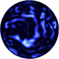
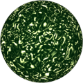

# TSL Textures


## satin
This texture recreates the wrinkles of a satin cloth. 
Click on a snapshot to open it online.

<p class="gallery">

	<a class="style-block nocaption" href="../online/satin.html?scale=1.24&color=7373055&background=80">
		
	</a>

	<a class="style-block nocaption" href="../online/satin.html?scale=0.72&color=15597568&background=16774902">
		
	</a>

	<a class="style-block nocaption" href="../online/satin.html?scale=3.6&color=10336135&background=26926&seed=0">
		
	</a>

</p>


### Code example

```js
import { satin } from "tsl-textures/satin.js";

model.material.colorNode = satin ( {
	scale: 2,
	color: new THREE.Color(7373055),
	background: new THREE.Color(80),
	seed: 0
} );
```


### Parameters

* `scale` &ndash; level of details of the pattern, higher value generates finer details, [0, 4]
* `color` &ndash; main color of glossy parts
* `background` &ndash; background color of dark parts
* `seed` &ndash; number for the random generator, each value generates specific pattern


### Online generator

[online/satin.html](../online/satin.html)


### Source

[src/satin.js](https://github.com/boytchev/tsl-textures/blob/main/src/satin.js)


		
<div class="footnote">
	<a href="../">Home</a>
</div>