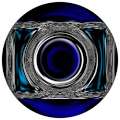
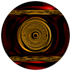

# TSL Textures


## Scepter head

This texture designs the stone and the metal rim of a scepter
head. The generated texture is intended for spherical objects.
Click on a snapshot to open it online.

<p class="gallery">

	<a class="style-block nocaption" href="../online/scepter-head.html?xFactor=10&yFactor=22&zFactor=10&colorRim=16777215&colorA=7397631&colorB=3145983">
		
	</a>

	<a class="style-block nocaption" href="../online/scepter-head.html?xFactor=66&yFactor=31&zFactor=18&colorRim=16765184&colorA=7521605&colorB=49717">
		
	</a>

	<a class="style-block nocaption" href="../online/scepter-head.html?xFactor=0&yFactor=18&zFactor=6&colorRim=16765184&colorA=11599872&colorB=16763851">
		
	</a>

</p>


### Code template

```js
import { scepterHead } from "tsl-textures";

model.material.colorNode = scepterHead ( {
	xFactor: 10,
	yFactor: 22,
	zFactor: 10,
	colorRim: new THREE.Color(16777215),
	colorA: new THREE.Color(16769248),
	colorB: new THREE.Color(3145983)
} );
```

### Parameters

* `position` &ndash; coordinates used to map texture, default is TSL `positionGeometry` node
* `xFactor` &ndash; rim design along X axis, [0,100]
* `yFactor` &ndash; rim design along Y axis, [0,100]
* `zFactor` &ndash; rim design along Z axis, [0,100]
* `colorRim` &ndash; color of the rim
* `colorA` &ndash; stone color
* `colorB` &ndash; sdcendant stone color


### Online generator

[online/scepter-head.html](../online/scepter-head.html)


### Source

[src/scepter-head.js](https://github.com/boytchev/tsl-textures/blob/main/src/scepter-head.js)

		
<div class="footnote">
	<a href="../">Home</a>
</div>