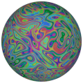
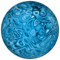
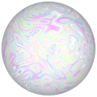

# TSL Textures


## Scream
This texture attempts imitate the curves from the famous
painting ["The Scream"](https://en.wikipedia.org/wiki/The_Scream)
by Edvard Munch. Click on a snapshot to open it online.

<p class="gallery">

	<a class="style-block nocaption" href="../online/scream.html?scale=1.4&variety=1&color=15790176&background=13668496">
		
	</a>

	<a class="style-block nocaption" href="../online/scream.html?http://localhost/online/scream?scale=1.592&variety=0&color=16777215&background=5330612">
		
	</a>

	<a class="style-block nocaption" href="../online/scream.html?http://localhost/online/scream?scale=1.6&variety=1&color=16711909&background=13752561">
		
	</a>

</p>


### Code example

```js
import { scream } from "tsl-textures/scream.js";

model.material.colorNode = scream ( {
	scale: 2,
	variety: 1,
	color: new THREE.Color(15790176),
	background: new THREE.Color(13668496),
	seed: 0,
} );
```


### Parameters

The parameters of the texture generator are:

* `scale` &ndash; level of details of the pattern, higher value generates finer details, [0, 4]
* `variety` &ndash; hue variety of colors, [0, 1]
* `color` &ndash; main color
* `background` &ndash; secondary color


### Online generator

[online/scream.html](../online/scream.html)


### Source

[src/scream.js](https://github.com/boytchev/texture-generator/blob/main/src/scream.js)


<div class="footnote">
	<a href="../">Home</a>
</div>