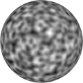
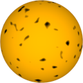
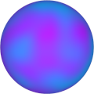

# TSL Textures


## Simplex noise
This texture renders [Simplex noise](https://en.wikipedia.org/wiki/Simplex_noise)
pattern. Click on a snapshot to open it online.

<p class="gallery">

	<a class="style-block nocaption" href="../online/simplex-noise.html?scale=2&balance=0&contrast=0&color=16777215&background=0">
		
	</a>

	<a class="style-block nocaption" href="../online/simplex-noise.html?scale=1.76&balance=1.92&contrast=2&color=16766720&background=0">
		
	</a>

	<a class="style-block nocaption" href="../online/simplex-noise.html?scale=0.48&balance=0&contrast=0&color=57599&background=15007999">
		
	</a>

</p>


### Code example

```js
import { simplexNoise } from "tsl-textures/simplex-noise.js";

model.material.colorNode = simplexNoise ( {
	scale: 2,
	balance: 0,
	contrast: 0,
	color: new THREE.Color(16777215),
	background: new THREE.Color(0),
	seed: 0
} );
```


### Parameters

* `scale` &ndash; level of details of the pattern, higher value generates finer details, [0, 4]
* `balance` &ndash; balance of color and background, [-3,3]
* `contrast` &ndash; sharpness of contrast between color and background, [-2,2]
* `color` &ndash; primary color
* `background` &ndash; color of background
* `seed` &ndash; number for the random generator, each value generates specific pattern


### Online generator

[online/simplex-noise.html](../online/simplex-noise.html)


### Source

[src/simplex-noise.js](https://github.com/boytchev/tsl-textures/blob/main/src/simplex-noise.js)

		
<div class="footnote">
	<a href="../">Home</a>
</div>