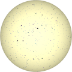

# TSL Textures


## Stars
This texture renders a sky with stars. Click on a snapshot
to open it online.

<p class="gallery">

	<a class="style-block nocaption" href="../online/stars.html?scale=2&density=2&variation=0&color=16774640&background=96&seed=0">
		
	</a>

	<a class="style-block nocaption" href="../online/stars.html?scale=2.44&density=3&variation=0&color=16777215&background=4697817&seed=0">
		
	</a>

	<a class="style-block nocaption" href="../online/stars.html?scale=2.56&density=3&variation=1&color=0&background=16776674&seed=0">
		
	</a>

</p>


### Code example

```js
import { stars } from "tsl-textures";

model.material.colorNode = stars ( {
	scale: 2,
	density: 2,
	variation: 0,
	color: new THREE.Color(16774640),
	background: new THREE.Color(96),
	seed: 0
} );
```


### Parameters

* `position` &ndash; coordinates used to map texture, default is TSL `positionGeometry` node
* `scale` &ndash; level of details of the pattern, higher value generates finer details, [0, 4]
* `density` &ndash; density of stars, [0,5]
* `variation` &ndash; hue variation, [0,1]
* `color` &ndash; color of stars
* `background` &ndash; color of sky
* `seed` &ndash; number for the random generator, each value generates specific pattern

Darker stars *color* reduces the amount of visible stars, same like reduction
in *density*. Hue *variation* is noticeable when the *color* of stars is not
pure neutral (i.e. white or black).


### Online generator

[online/stars.html](../online/stars.html)


### Source

[src/stars.js](https://github.com/boytchev/tsl-textures/blob/main/src/stars.js)

		
<div class="footnote">
	<a href="../">Home</a>
</div>