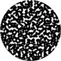

# TSL Textures


## Static noise
This texture renders a static noise with possibility to update
the pattern at time intervals. The texture is supposed to be
added as additional layer (e.g. AO or light), not as primary
diffuse color. The static noise is generated in screen space.
Click on a snapshot to open it online.

<p class="gallery">

	<a class="style-block nocaption" href="../online/static-noise.html?scale=2&balance=0&contrast=0&delay=0&seed=0">
		
	</a>

	<a class="style-block nocaption" href="../online/static-noise.html?scale=0.92&balance=0.54&contrast=0.4&delay=0&seed=0">
		
	</a>

	<a class="style-block nocaption" href="../online/static-noise.html?scale=3.08&balance=-0.78&contrast=2&delay=0&seed=0">
		
	</a>

</p>


### Code example

```js
import { staticNoise } from "tsl-textures";

model.material.colorNode = staticNoise ( {
	scale: 2,
	balance: 0,
	contrast: 0,
	delay: 0,
	seed: 0
} );
```


### Parameters

* `scale` &ndash; level of details of the pattern, higher value generates finer details, [0, 4]
* `balance` &ndash; balance of color and background, [-3,3]
* `contrast` &ndash; sharpness of contrast between color and background, [-2,2]
* `delay` &ndash; delay for automatic change of noise, 0 is for FPS=148, 1 is for FPS=1
* `seed` &ndash; number for the random generator, each value generates specific pattern


### Online generator

[online/static-noise.html](../online/static-noise.html)


### Source

[src/static-noise.js](https://github.com/boytchev/tsl-textures/blob/main/src/static-noise.js)

		
<div class="footnote">
	<a href="../">Home</a>
</div>