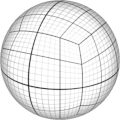
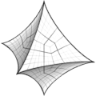
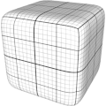

# TSL Textures


## Supersphere

This texture deforms a spherical shape into a [supersphere](https://mathworld.wolfram.com/Supersphere.html)
with equation |x|<sup>n</sup>+|y|<sup>n</sup>+|z|<sup>n</sup>=|r|<sup>n</sup>,
where `r` is the radius of the supersphere and n=2<sup>`exponent`</sup>.

Different values for the `exponent` parameter define different shapes of the supersphere:

| Exponent | n | Shape |
| --- | --- | --- |
| 0 | 1 | Octahedron |
| 1 | 2 | Sphere |
| 3 | 8 | Rounded cube |
| 7 | 128 | Almost a cube |


<p class="gallery">

	<a class="style-block nocaption" href="../online/supersphere.html?exponent=-0.4">
		
	</a>

	<a class="style-block nocaption" href="../online/supersphere.html?exponent=1">
		
	</a>

	<a class="style-block nocaption" href="../online/supersphere.html?exponent=3">
		
	</a>

</p>


### Code template

```js
import * as THREE from "three";
import { supersphere } from "tsl-textures/supersphere.js";

model.material.positionNode = supersphere ( {
	exponent: -0.4
} );

model.material.normalNode = supersphere.normal ( {
	exponent: -0.4
} );
```


### Parameters

* `exponent` &ndash; the power-to-two exponent of the supersphere, [-1,7]


### Online generator

[online/supersphere.html](../online/supersphere.html)


### Source

[src/supersphere.js](https://github.com/boytchev/tsl-textures/blob/main/src/supersphere.js)


		
<div class="footnote">
	<a href="../">Home</a>
</div>