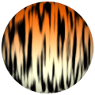
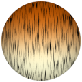
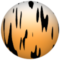

# TSL Textures


## Tiger fur

This texture renders a pattern that resembles tiger fur.
Click on a snapshot to open it online.

<p class="gallery">

	<a class="style-block nocaption" href="../online/tiger-fur.html?scale=2&lengths=4&blur=0.3&strength=0.3&hairs=0.5&color=16755200&bottomColor=16777198&seed=0">
		
	</a>

	<a class="style-block nocaption" href="../online/tiger-fur.html?scale=4&lengths=16&blur=0.3&strength=0&hairs=0.65&color=14523136&bottomColor=16513511&seed=0">
		
	</a>

	<a class="style-block nocaption" href="../online/tiger-fur.html?scale=1.28&lengths=1.8&blur=0&strength=0.3&hairs=0.02&color=16777215&bottomColor=16041852&seed=0">
		
	</a>

</p>


### Code example

```js
import { tiger-fur } from "tsl-textures";


model.material.colorNode = tigerFur ( {
	scale: 2,
	lengths: 4,
	blur: 0.3,
	strength: 0.3,
	hairs: 0.5,
	color: new THREE.Color(16755200),
	bottomColor: new THREE.Color(16777198),
	seed: 0
} );
```


### Parameters

* `scale` &ndash; level of details of the pattern, higher value generates finer details, [0, 4]
* `lengths` &ndash; lengths of fur lines, [0,20]
* `blur` &ndash; smoothness of lines edges, [0,1]
* `strength` &ndash; amount (thickness) of lines, [0,1]
* `hairs` &ndash; amount of this hairs aroud the lines, [0,1]
* `color` &ndash; fur color at the top
* `bottomColor` &ndash; fur color at the bottom
* `seed` &ndash; number for the random generator, each value generates specific pattern


### Online generator

[online/tiger-fur.html](../online/tiger-fur.html)


### Source

[src/tiger-fur.js](https://github.com/boytchev/tsl-textures/blob/main/src/tiger-fur.js)


		
<div class="footnote">
	<a href="../">Home</a>
</div>