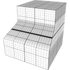
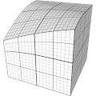
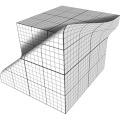

# TSL Textures


## Translator

This texture deforms a shape by moving part of its vertices.

The selection of affected vertices is set by a imaginary thick planar
layer. Vertices "below" the layer are not affected, vertices above the layer are
fully affected. Vertices inside the layer are gradually affected depending on
how close they are to the "bottom" or the "top" of the layer. The layer is
defined by its own pivot point, rotation agles and width.

Hint: use the `show` checkbox of the online generator to visualize the layer.

<p class="gallery">

	<a class="style-block nocaption" href="../online/translator.html?distance=-0.32,-0.16,-1.52&selectorCenter=0,0,0&selectorAngles=0,0&selectorWidth=0.4992">
		
	</a>

	<a class="style-block nocaption" href="../online/translator.html?distance=0,-4,0&selectorCenter=2.776,1.2,0&selectorAngles=0.74,1.06&selectorWidth=4">
		
	</a>

	<a class="style-block nocaption" href="../online/translator.html?distance=0,-0.64,0.8&selectorCenter=0,0,0&selectorAngles=0.74,1.06&selectorWidth=0.7137">
		
	</a>

</p>


### Code template

```js
import * as THREE from "three";
import { translator } from "tsl-textures";

model.material.positionNode = translator ( {
	distance: new THREE.Vector3(-0.5,0,0.2),
	selectorCenter: new THREE.Vector3(0,0,0),
	selectorAngles: new THREE.Vector2(0,0),
	selectorWidth: 0.7
} );

model.material.normalNode = translator.normal ( {
	distance: new THREE.Vector3(-0.5,0,0.2),
	selectorCenter: new THREE.Vector3(0,0,0),
	selectorAngles: new THREE.Vector2(0,0),
	selectorWidth: 0.7
} );
```


### Parameters

* `distance(x,y,z)` &ndash; distances along local X, Y and Z axes
* `selectorAngles(φ,θ)` &ndash; spherical coordinates angles for rotation of the selection layer, φ=[0, &pi;], θ=[-2&pi;, 2&pi;]
* `selectorCenter(x,y,z)` &ndash; 3D pivot point for the selection layer
* `selectorWidth` &ndash; number for the selection layer width, [0.1, 4]


### Online generator

[online/translator.html](../online/translator.html)


### Source

[src/translator.js](https://github.com/boytchev/tsl-textures/blob/main/src/translator.js)


		
<div class="footnote">
	<a href="../">Home</a>
</div>