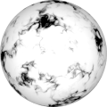
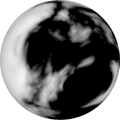
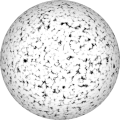

# TSL Textures


## Turbulent smoke

This texture recreates an animated turbulent smoke. Click on a snapshot to open it online.

<p class="gallery">

	<a class="style-block nocaption" href="../online/turbulent-smoke.html?scale=2&speed=0&details=5&seed=0">
		
	</a>

	<a class="style-block nocaption" href="../online/turbulent-smoke.html?scale=0&speed=0&details=5&seed=8728">
		
	</a>

	<a class="style-block nocaption" href="../online/turbulent-smoke.html?scale=4&speed=1.164&details=1&seed=8728">
		
	</a>

</p>


### Code example

```js
import { turbulentSmoke } from "tsl-textures";

model.material.colorNode = turbulentSmoke ( {
	scale: 2,
	speed: 0,
	details: 5,
	seed: 0
} );

```


### Parameters

* `position` &ndash; coordinates used to map texture, default is TSL `positionGeometry` node
* `scale` &ndash; level of details of the pattern, higher value generates finer details, [0, 4]
* `speed` &ndash; smoke speed, negative values are slow, positive values are fast, [-2,2]
* `details` &ndash; number of iterations [1,10]
* `time` &ndash; current time for smoke animation, defaut is TSL's `time` node
* `seed` &ndash; number for the random generator, each value generates specific pattern


### Online generator

[online/turbulent-smoke.html](../online/turbulent-smoke.html)


### Source

[src/turbulent-smoke.js](https://github.com/boytchev/tsl-textures/blob/main/src/turbulent-smoke.js)


		
<div class="footnote">
	<a href="../">Home</a>
</div>