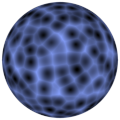
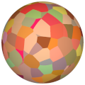
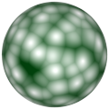

# TSL Textures


## Voronoi cells

This texture generates a pattern of [Worley noise](https://en.wikipedia.org/wiki/Worley_noise) based on 3D
[Voronoi diagram](https://en.wikipedia.org/wiki/Voronoi_diagram).
Click on a snapshot to open it online.

<p class="gallery">

	<a class="style-block nocaption" href="../online/voronoi-cells.html?scale=2&variation=0&flat=0&color=0&background=12636415&seed=0">
		
	</a>

	<a class="style-block nocaption" href="../online/voronoi-cells.html?scale=1.4&variation=0.6&flat=1&color=16711680&background=15466431&seed=0">
		
	</a>

	<a class="style-block nocaption" href="../online/voronoi-cells.html?scale=1.28&variation=0&flat=0&color=16777215&background=34360&seed=0">
		
	</a>

</p>


### Code template

```js
import { voronoiCells } from "tsl-textures";

model.material.colorNode = voronoiCells ( {
	scale: 2,
	variation: 0,
	flat: 0,
	color: new THREE.Color(0),
	background: new THREE.Color(12636415),
	seed: 0
} );
```


### Parameters

* `scale` &ndash; level of details of the pattern, higher value generates finer details, [0, 4]
* `flat` &ndash; how flat is the color in each voronoi cell, [0,1]
* `variation` &ndash; color variation, [0,1]
* `color` &ndash; main color of cell interior
* `background` &ndash; color of boundaries between cells
* `seed` &ndash; number for the random generator, each value generates specific pattern


### Online generator

[online/voronoi-cells.html](../online/voronoi-cells.html)


### Source

[src/voronoi-cells.js](https://github.com/boytchev/tsl-textures/blob/main/src/voronoi-cells.js)


		
<div class="footnote">
	<a href="../">Home</a>
</div>