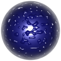
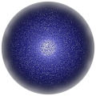

# TSL Textures


## Water drops

This texture renderes a texture for simulating water drops
or frosted surfaces. For a better effect the texture alone
is not sufficient. It is designed to be used as normap map
node on a mesh with material with tangents. Click on a
snapshot to open it online.

<p class="gallery">

	<a class="style-block nocaption" href="../online/water-drops.html?scale=1&density=0.5&bump=0.6">
		
	</a>

	<a class="style-block nocaption" href="../online/water-drops.html?scale=0&density=0.82&bump=0.6&seed=4223">
		
	</a>

	<a class="style-block nocaption" href="../online/water-drops.html?scale=3.68&density=0.77&bump=0.29&seed=4223">
		
	</a>

</p>


### Code example

```js
import { waterDrops } from "tsl-textures/water-drops.js";

model.material.normalNode = waterDrops ( {
	scale: 1.4,
	density: 0.5,
	bump: 0.6,
	seed: 0
} );
```


### Parameters

* `scale` &ndash; level of details of the pattern, higher value generates smaller drops, [0, 4]
* `density` &ndash; density of drops [0,1]
* `bump` &ndash; bumpiness (height) of drops [0,1]


### Online generator

[online/water-drops.html](../online/water-drops.html)


### Source

[src/water-drops.js](https://github.com/boytchev/tsl-textures/blob/main/src/water-drops.js)


		
<div class="footnote">
	<a href="../">Home</a>
</div>