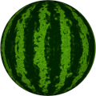
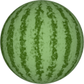
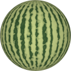

# TSL Textures


## Watermelon
This texture renderes the surface of a watermelon with two colors - one for the
stripes and one for the area between the stripes. Click on a snapshot to open it online.

<p class="gallery">

	<a class="style-block nocaption" href="../online/watermelon?scale=2&stripes=12&variation=0.5&noise=0.25&color=10145074&background=25600&seed=0">
		
	</a>

	<a class="style-block nocaption" href="../online/watermelon?scale=2&stripes=16&variation=0.57&noise=0.36&color=7970090&background=12506285&seed=0">
		
	</a>
	
	<a class="style-block nocaption" href="../online/watermelon?scale=0&stripes=30&variation=0.55&noise=0&color=5472346&background=14212790&seed=0">
		
	</a>

</p>


### Code example

```js
import { watermelon } from "tsl-textures";

model.material.colorNode = watermelon ( {
	scale: 2,
	stripes: 12,
	variation: 0.5,
	noise: 0.25,
	color: new THREE.Color(10145074),
	background: new THREE.Color(25600),
	seed: 0
} );
```


### Parameters

* `scale` &ndash; level of details of the stripes, higher value generates finer details, [0, 4]
* `stripes` &ndash; number of stripes, [4, 30]
* `variation` &ndash; variation of the stripes, [0, 1]
* `noise` &ndash; additional noise over the stripes, [0, 1]
* `color` &ndash; color of stripes
* `background` &ndash; color of background
* `seed` &ndash; number for the random generator, each value generates specific pattern


### Online generator

[online/watermelon.html](../online/watermelon.html)


### Source

[src/watermelon.js](https://github.com/boytchev/tsl-textures/blob/main/src/watermelon.js)

		
<div class="footnote">
	<a href="../">Home</a>
</div>