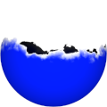
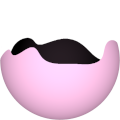
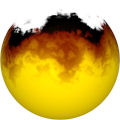

# TSL Textures


## Waves

This texture recreates an animated wave-like texture with foam. The wave front
could be controlled in terms of smoothness and size. Click on a snapshot to open
it online.

<p class="gallery">

	<a class="style-block nocaption" href="../online/waves.html?scale=2&speed=0&level=-0.4&rough=10&height=0.5&foamSize=0.2&foamEdge=0.5&color=16777215&background=2121983&seed=0">
		
	</a>

	<a class="style-block nocaption" href="../online/waves.html?scale=0.88&speed=-0.16&level=-0.02&rough=1&height=0.5&foamSize=0&foamEdge=1&color=16711680&background=16769781&seed=0">
		
	</a>

	<a class="style-block nocaption" href="../online/waves.html?scale=2.36&speed=-0.16&level=-0.26&rough=14&height=1&foamSize=0.83&foamEdge=0&color=11141120&background=16641536&seed=0">
		
	</a>

</p>


### Code example

```js
import { waves } from "tsl-textures";
model.material.colorNode = waves ( {
	scale: 2,
	speed: 0,
	level: -0.4,
	rough: 10,
	height: 0.5,
	foamSize: 0.2,
	foamEdge: 0.5,
	color: new THREE.Color(16777215),
	background: new THREE.Color(2121983),
	seed: 0
} );

model.material.transparent = true;
model.material.opacity = 1;
model.material.side = THREE.DoubleSide;
model.material.opacityNode = waves.opacity ( {
	scale: 2,
	speed: 0,
	level: -0.4,
	rough: 10,
	height: 0.5,
	foamSize: 0.2,
	foamEdge: 0.5,
	color: new THREE.Color(16777215),
	background: new THREE.Color(2121983),
	seed: 0
} );
```


### Parameters

* `position` &ndash; coordinates used to map texture, default is TSL `positionGeometry` node
* `scale` &ndash; level of details of the pattern, higher value generates finer details, [0, 4]
* `speed` &ndash; waves motion speed, negative values are slow, positive values are fast, [-2,2]
* `time` &ndash; current time for brain wave animation, defaut is TSL's `time` node
* `level` &ndash; vertical level of wave
* `rough` &ndash; roughness of wave, 1 is smooth, 15 is rough, [1,15]
* `height` &ndash; the vertical size of waves, [0,1]
* `foamSize` &ndash; size of the foam, [0,1]
* `foamEdge` &ndash; sharpness of the foam edge, [0,1]
* `color` &ndash; color of the water
* `background` &ndash; color of the foam
* `seed` &ndash; number for the random generator, each value generates specific pattern


### Online generator

[online/waves.html](../online/waves.html)


### Source

[src/waves.js](https://github.com/boytchev/tsl-textures/blob/main/src/waves.js)


		
<div class="footnote">
	<a href="../">Home</a>
</div>